<p align="center">
  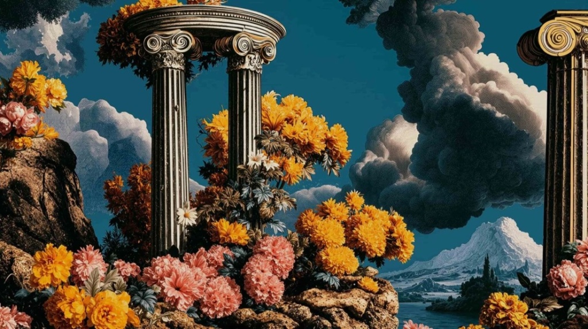
</p>

<h1 align="center">Aegis Flora</h1>
<p align="center">
  <em>Solarpunk-Mecha Mazing Tower Defense</em><br/>
  <sub>Classical ruins. Living labyrinths. Diesel war-machines.</sub>
</p>

<p align="center">
  <a href="https://murderszn.github.io/aegis-flora/"><strong>🌐 Play in Browser</strong></a>&nbsp;&nbsp;·&nbsp;&nbsp;
  <a href="#-getting-started"><strong>⚡ Quick Start</strong></a>&nbsp;&nbsp;·&nbsp;&nbsp;
  <a href="./GDD.md"><strong>📖 Game Design Doc</strong></a>&nbsp;&nbsp;·&nbsp;&nbsp;
  <a href="#-documentation"><strong>📚 Docs</strong></a>
</p>

<p align="center">
  
  
  
  
  
</p>

---

## 🎮 What Is Aegis Flora?

**Aegis Flora** reimagines the open-grid mazing purity of **Robo Defense** and **WC3 Wintermaul** with the visual spectacle, particle kineticism, and HUD polish of **Dota 2**.

Players place living brass-and-marble defense engines onto an open Greco-Roman ruins battlefield—sculpting serpentine labyrinths, choke points, and kill boxes—to deflect, delay, and obliterate oncoming waves of rogue autonomous dieselpunk war-machines before they breach the **Verdant Sanctum**.

### Core Pillars

| Pillar | Description |
|--------|-------------|
| **🏛 The Maze Is the Weapon** | Every tower is a physical wall. A well-designed maze turns a 10-second march into a 90-second gauntlet. Real-time A* path validation ensures you can never completely seal the path. |
| **⚡ Dota 2-Tier Juice** | Recoiling barrels, glowing petal heat-sinks, arcing mortar shells with smoke trails, scorch decals, physics debris on death, and floating combat numbers. |
| **🌿 Solarpunk-Mecha Aesthetic** | Weathered Corinthian colonnades overgrown with chrysanthemums and wisteria, fused with riveted iron boilers and cyan mana-crystals. |
| **🎯 Branching Specialization** | Every tower evolves from T1 → T2 → T3 (Branch A or B), each with unique mechanics like beam splitting, armor stripping, and piercing shots. |

---

## 🖼 Gallery

<p align="center">
  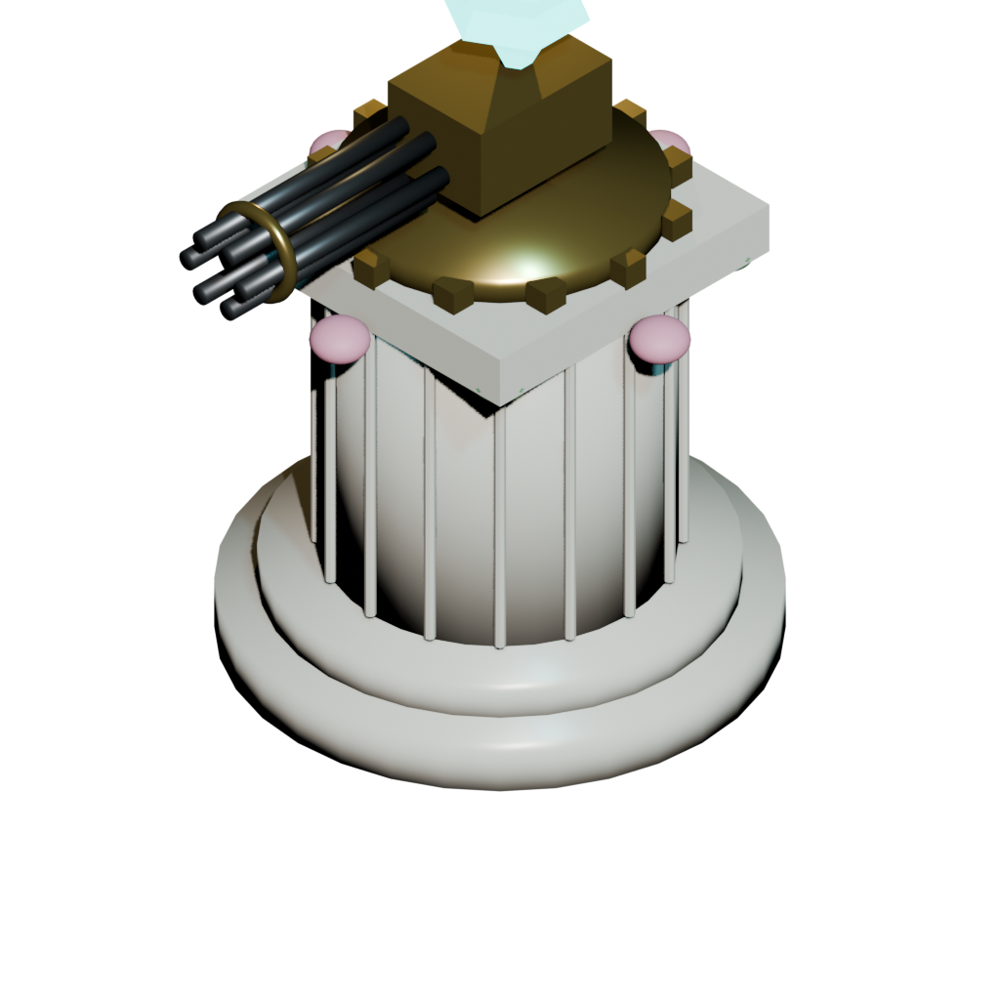
  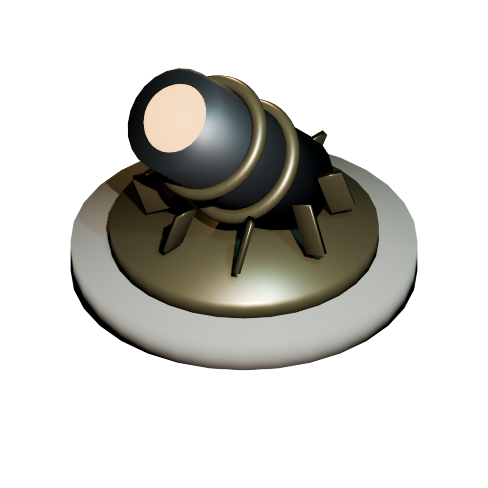
  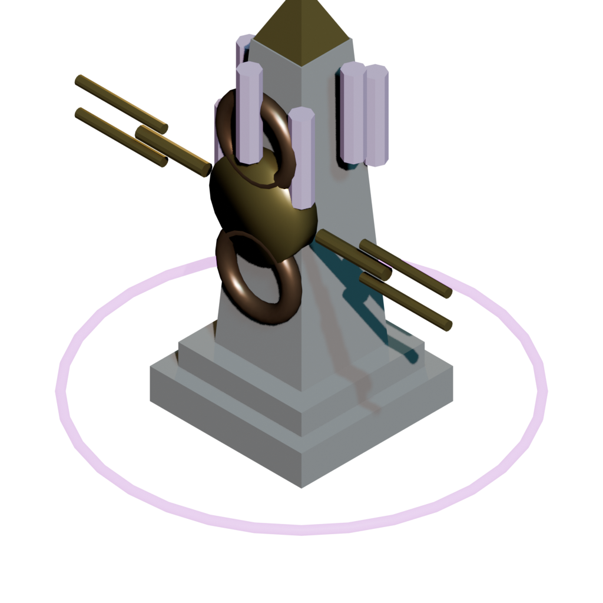
</p>
<p align="center">
  <sub>Towers — Prism Gatling · Bloom Cannon · Resonance Monolith</sub>
</p>

<p align="center">
  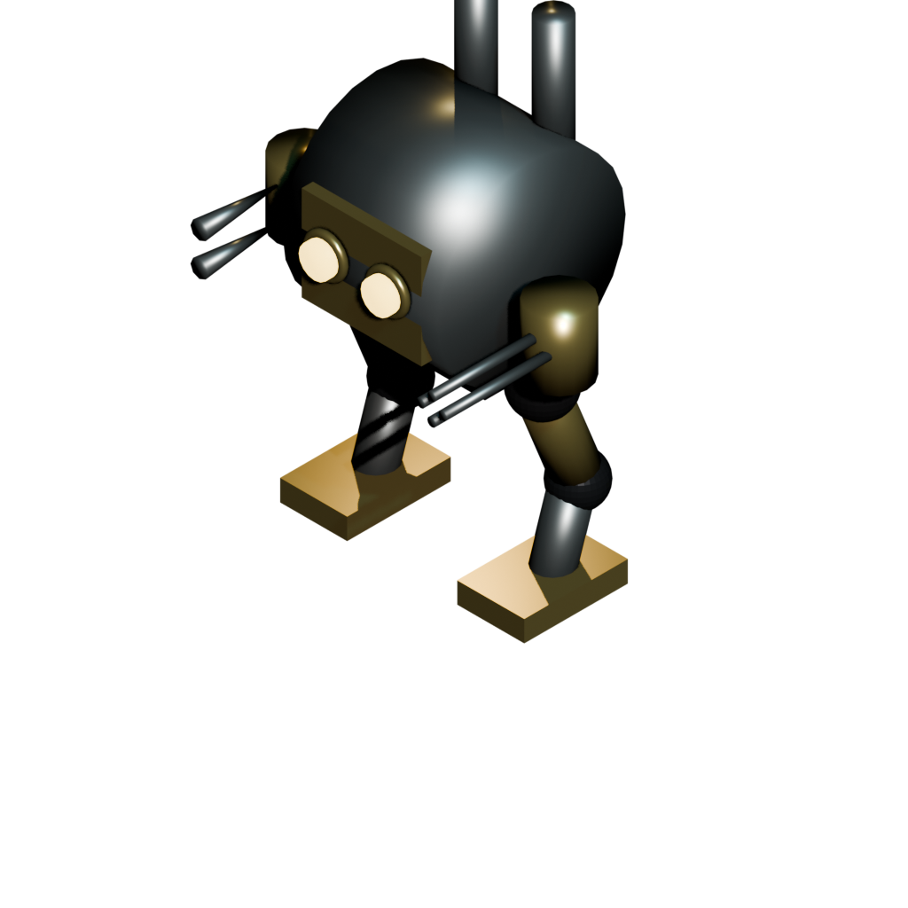
  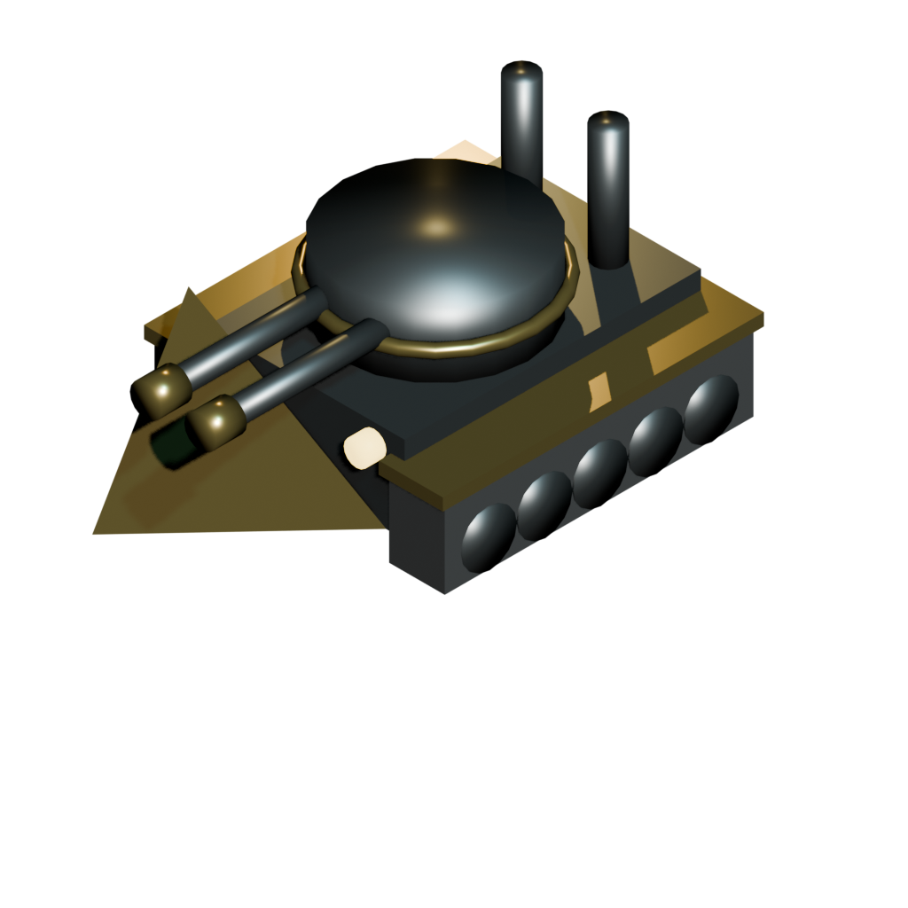
  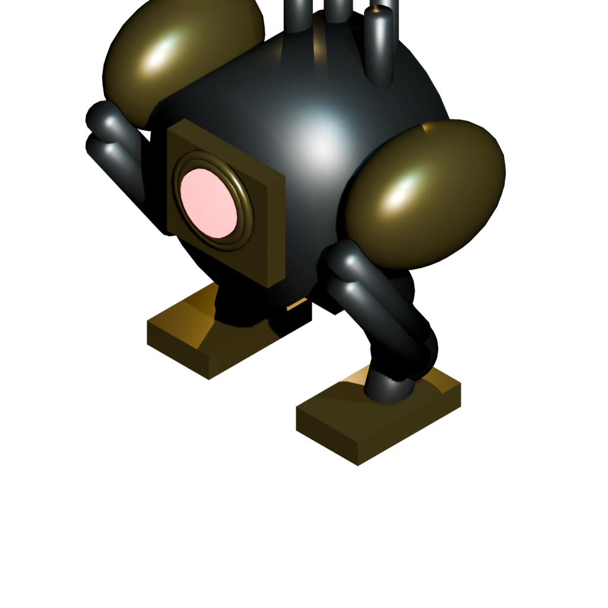
</p>
<p align="center">
  <sub>Enemies — Diesel Walker · Tread Tank · Goliath Colossus</sub>
</p>

<p align="center">
  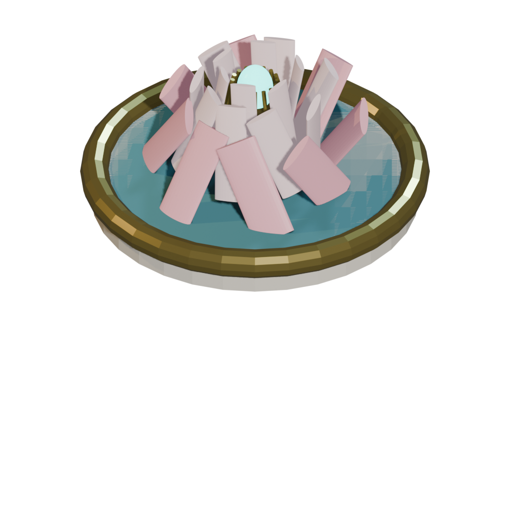
  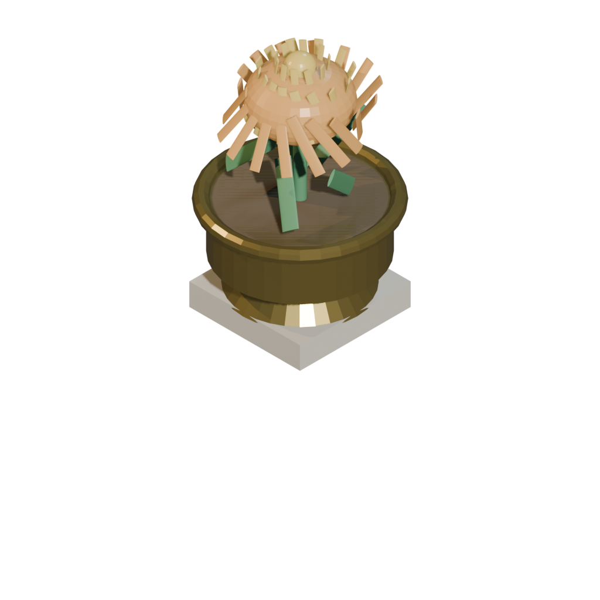
  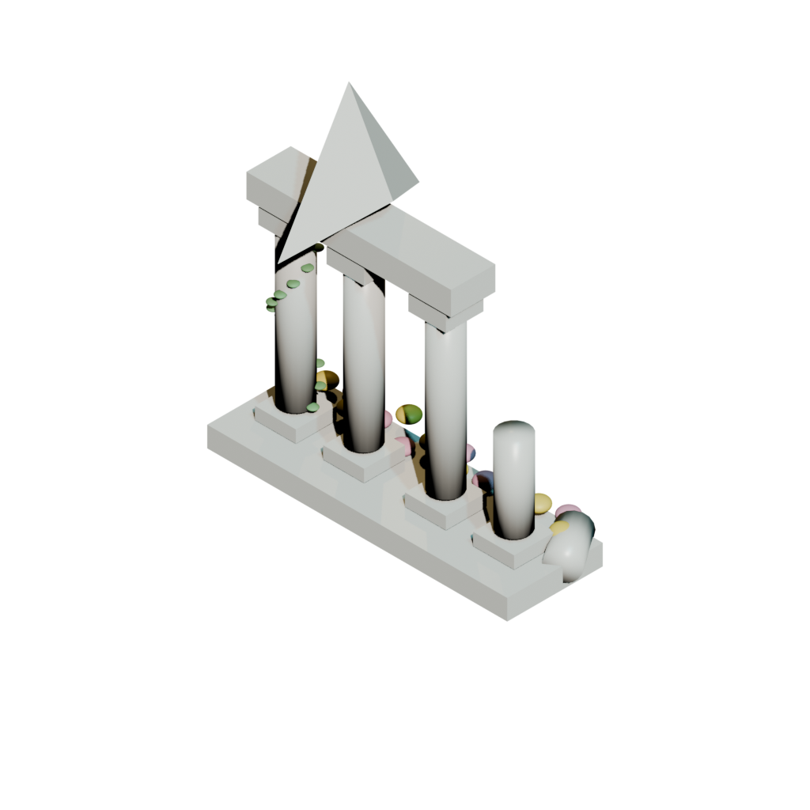
  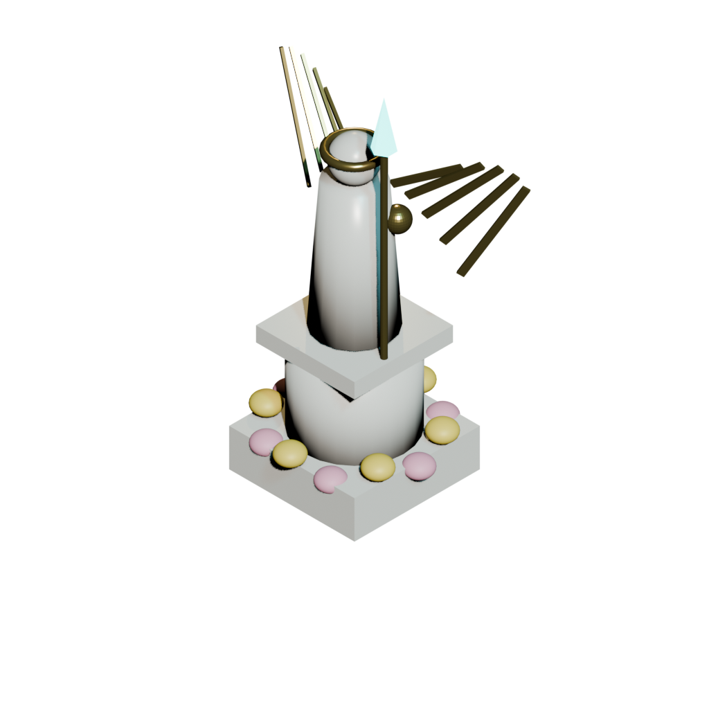
</p>
<p align="center">
  <sub>Flora & Environment — Clockwork Lotus · Golden Chrysanthemum · Grand Colonnade · Automata Athena</sub>
</p>

---

## ⚡ Getting Started

### Play Online
The game is hosted on GitHub Pages:

**→ [https://murderszn.github.io/aegis-flora/](https://murderszn.github.io/aegis-flora/)**

### Run Locally

No build tools required — it's a static HTML/JS application.

```bash
# Clone the repository
git clone https://github.com/murderszn/aegis-flora.git
cd aegis-flora

# Serve locally (pick any static file server)
npx serve .
# or
python3 -m http.server 8000
# or
php -S localhost:8000
```

Then open [http://localhost:8000](http://localhost:8000) (landing page) or [http://localhost:8000/game.html](http://localhost:8000/game.html) (jump straight into the game).

> [!NOTE]
> A local HTTP server is required for GLTF model loading (the browser blocks `file://` cross-origin requests for `.glb` assets).

---

## 🕹 Controls

| Key | Action |
|-----|--------|
| `Q` or `1` | Select **Kinetic Gatling** (100 Scrap) — rapid-fire kinetic turret |
| `W` or `2` | Select **Spore Mortar** (150 Scrap) — AoE artillery battery |
| `E` or `3` | Select **Solar Beam** (175 Scrap) — sustained focus thermal beam |
| `R` or `4` | Select **Resonance Obelisk** (125 Scrap) — radial acoustic slow/armor shred |
| `Space` | Start Wave / Call Next Wave |
| `D` | **Verdant Overgrowth** — root all creeps in 4×4 area & deal sonic damage (35 Mana) |
| `F` | **Solar Flare** — orbital solar lance on cursor tile (75 Mana) |
| `Tab` or `Y` | Cycle tower target priority (First, Last, Strongest, Weakest, Closest) |
| `K` | Toggle **Tactical Clarity** mode (scenery dimming & high contrast) |
| `G` | Toggle **Verdant Glyphs** conservatory modal |
| `?` | Replay 8-step guided mazing tutorial |
| `P` | Pause / Resume gameplay |
| `V` | Cycle game speed (1× / 2× / 4×) |
| `M` | Toggle master audio mute |
| `C` / `T` | Toggle Isometric (C) / Tactical Over-the-shoulder (T) camera views |
| `F11` / `Shift+F` | Toggle fullscreen mode |
| `Esc` | Clear selection / close modal / open Settings |
| Mouse | Left-click to place/inspect · Right-click to cancel · Scroll to zoom |

### 🎮 Gamepad Support (Xbox / PlayStation / Switch)

| Button | Action |
|--------|--------|
| Left Stick | Pan camera across the map |
| Right Stick | Orbit & pitch camera |
| LT / RT | Zoom in / out |
| A / Cross | Place tower / inspect unit at crosshair |
| B / Circle | Cancel placement / close panel |
| X / Square | Cycle tower target priority |
| Y / Triangle | Toggle camera view |
| LB / RB | Cycle tower selection |
| D-Pad | Quick tower selection (Up/Down/Left/Right) |
| Start | Pause game |
| Back / View | Cycle game speed |
| Rumble | Haptic vibration on explosions, flares, and leaks |

---

## 🏗 Tower Arsenal

```
                      ┌─────────────────────┐
                      │    BASE TOWER (T1)   │
                      └──────────┬──────────┘
                                 │
                            [ Upgrade ]
                                 │
                      ┌──────────▼──────────┐
                      │  ADVANCED FORM (T2)  │
                      └───────┬──────┬──────┘
                              │      │
                         [Branch A] [Branch B]
                              │      │
                   ┌──────────▼──┐ ┌─▼──────────┐
                   │ ELITE T3 (A)│ │ ELITE T3 (B)│
                   └─────────────┘ └─────────────┘
```

| Tower | Role | T3-A | T3-B |
|-------|------|------|------|
| **Gatling Plinth** `Q` | Fast kinetic DPS | Phalanx Storm — 8-barrel incendiary, -3 armor | Rail-Needler — pierces 3 creeps in a line |
| **Bloom Cannon** `W` | AoE artillery | Skyburst Flak — 2.5× vs air units | Cataclysm Bloom — ground fissures, 40% slow |
| **Prism Pillar** `E` | Sustained beam | Sol Invictus — piercing scorch line | Refraction Prism — splits into 3 beams |
| **Resonance Monolith** `R` | Crowd control | Chrono-Stutter — every 4th pulse stuns | Resonance Shatter — strips 50% armor |

---

## 👾 Enemy Forces

| Unit | Type | Special |
|------|------|---------|
| **Skitter Scout** | Light Swarm | Fast packs of 12–20; weak individually |
| **Steam Prowler** | Skirmisher | +20% dodge chance; steam screen evasion |
| **Tread Tank** | Heavy Armor | High kinetic resistance; slow but durable |
| **Rotor Drone** | Aerial | Flies over maze walls; requires anti-air |
| **Zeppelin Sky-Hull** | Aerial Heavy | Armored dirigible; ignores ground path |
| **Dreadnought Ram** | Siege | Can charge and damage towers if stalled |
| **Goliath Colossus** | Boss | Multi-phase; EMP, shields, drone swarms |

---

## 🏛 Architecture

```
aegis-flora/
├── index.html                    # Landing page (scrollytelling showcase)
├── game.html                     # Full game client (~4,500 lines)
├── hud.css                       # Dota 2-style HUD stylesheet
├── js/
│   ├── three.min.js              # Three.js r152 (3D engine)
│   ├── GLTFLoader.js             # glTF/glb model loader
│   └── OrbitControls.js          # Camera pan/zoom/rotate
├── GDD.md                        # Game Design Document
├── TECHNICAL_ARCHITECTURE.md     # Engine & systems spec
├── UI_AND_UX_SPEC.md             # HUD & interaction design
├── TOWER_AND_ENEMY_BALANCE_SHEET.md  # Stats, formulas, wave scaling
├── GRAPHICS_AND_ART_OVERHAUL_PROMPT.md  # AAA art direction manifesto
├── ANALYSIS.md                   # Gap analysis vs specs
├── TODO_COMPLETE.md              # Prioritized task backlog
├── blender_pipeline/
│   ├── models/*.glb              # Production 3D models (20 assets)
│   ├── renders/*.png             # Pre-rendered asset previews
│   ├── generate_3d_assets.py     # Blender automation — towers & sanctum
│   ├── generate_all_enemies_detailed.py  # Blender — enemy models
│   ├── generate_flora_and_ruins.py       # Blender — environment props
│   ├── generate_accents_and_art.py       # Blender — decorative accents
│   ├── generate_treasure_and_flowers.py  # Blender — collectibles & flora
│   └── render_image_asset_sheets.py      # Blender — render previews
├── Unity/
│   ├── UNITY_INTEGRATION_GUIDE.md        # Unity URP/HDRP import guide
│   └── Assets/
│       ├── Models/*.glb                  # Duplicated models for Unity
│       └── Scripts/
│           ├── Mazing/GridManager.cs         # 36×20 grid management
│           ├── Mazing/AStarPathfinder.cs     # A* with maze validation
│           ├── Towers/TowerController.cs     # 3D turret aiming & weapons
│           ├── Enemies/CreepAgent.cs         # Creep movement & combat
│           ├── Combat/BallisticProjectile.cs  # Parabolic artillery arcs
│           └── UI/DotaHUDController.cs       # HUD hotkeys & resource UI
└── desktop/                      # Electron Windows + macOS packaging (v1.1.0)
    ├── main.js                   # Electron main process
    ├── package.json              # Build config & electron-builder
    └── build/                    # Icons, entitlements, signing
```

### Technology Stack

| Layer | Technology |
|-------|-----------|
| **3D Rendering** | Three.js (r152) with WebGL2, orthographic isometric camera |
| **3D Assets** | Blender → glTF 2.0 (.glb), PBR materials, procedural generation |
| **Pathfinding** | Dynamic A* with speculative placement validation |
| **Audio** | Web Audio API — synthesized spatial effects & dynamic mixing |
| **Game Loop** | Fixed 60 Hz tick rate with delta-time interpolation |
| **HUD** | HTML/CSS overlay with Dota 2-style bottom tray console |
| **Hosting** | GitHub Pages (static) |
| **Unity Port** | C# scripts + URP/HDRP pipeline (in progress) |

---

## 📚 Documentation

| Document | Description |
|----------|-------------|
| [`GDD.md`](./GDD.md) | Complete game design — mechanics, mazing rules, towers, enemies, economy, meta-progression |
| [`TECHNICAL_ARCHITECTURE.md`](./TECHNICAL_ARCHITECTURE.md) | Engine internals — ECS, A* pathfinding, flow fields, combat pipeline, particle systems, performance budgets |
| [`UI_AND_UX_SPEC.md`](./UI_AND_UX_SPEC.md) | Dota 2 bottom console wireframes, placement validation UX, hotkeys, responsive viewport modes |
| [`TOWER_AND_ENEMY_BALANCE_SHEET.md`](./TOWER_AND_ENEMY_BALANCE_SHEET.md) | Full stat tables, Dota 2 armor formula, damage type matrix, wave scaling formulas, economy math |
| [`GRAPHICS_AND_ART_OVERHAUL_PROMPT.md`](./GRAPHICS_AND_ART_OVERHAUL_PROMPT.md) | AAA art direction manifesto — PBR materials, chiaroscuro lighting, 60-30-10 color hierarchy, particle polish |
| [`ANALYSIS.md`](./ANALYSIS.md) | Gap analysis of current implementation vs design specs |
| [`TODO_COMPLETE.md`](./TODO_COMPLETE.md) | Prioritized task backlog with effort/impact matrix |
| [`Unity/UNITY_INTEGRATION_GUIDE.md`](./Unity/UNITY_INTEGRATION_GUIDE.md) | Unity URP/HDRP import pipeline for the 3D models and C# scripts |

---

## 🎨 3D Asset Pipeline

All 3D models are generated procedurally via Blender Python scripts, exported as glTF 2.0 (`.glb`), and rendered for preview:

```bash
# Generate all tower and sanctum models
blender --background --python blender_pipeline/generate_3d_assets.py

# Generate all enemy models
blender --background --python blender_pipeline/generate_all_enemies_detailed.py

# Generate flora, ruins, and environment props
blender --background --python blender_pipeline/generate_flora_and_ruins.py

# Generate decorative accents (columns, masonry)
blender --background --python blender_pipeline/generate_accents_and_art.py

# Generate treasure chests, relics, and flower props
blender --background --python blender_pipeline/generate_treasure_and_flowers.py

# Render preview images for all models
blender --background --python blender_pipeline/render_image_asset_sheets.py
```

**20 production-ready .glb models** including:
- 3 towers + 1 sanctum core
- 6 enemies (scouts, tanks, walkers, drones, zeppelins, boss colossus)
- 6 flora & environment props (cypress, olive, lotus, colonnade, ruins)
- 4 decorative accents & collectibles (statues, treasure, urns, masonry)

---

## ⚙️ Game Mechanics Deep Dive

### Damage Types & Armor System

The game uses Dota 2's proven armor formula for diminishing-returns damage mitigation:

$$\text{Damage Multiplier} = 1 - \frac{0.06 \times \text{Armor}}{1 + 0.06 \times |\text{Armor}|}$$

| Damage Type | Color | Armor Interaction |
|-------------|-------|-------------------|
| **Kinetic** | 🟡 Yellow | +25% vs unarmored, -40% vs heavy armor |
| **Explosive** | 🟠 Orange | Neutral; AoE splash quadratic falloff |
| **Energy** | 🔵 Cyan | Ignores 50% of armor value |
| **Sonic** | 🟣 Purple | Pure damage — ignores armor completely |

### Economy

- **Scrap** — earned from kills; used to build & upgrade towers
- **Solar Mana** — regenerates at 4/sec (max 100); fuels Sanctum abilities
- **Verdant Glyphs** — persistent meta-progression currency earned across waves

### Wave Scaling (50 Progressive Waves)

$$\text{Creep HP}(W) = \text{Base HP} \times \left(1 + 0.22(W-1) + 0.012(W-1)^2\right) \times E(W)$$

where $E(W)$ is an early-game pacing bump (+67% at wave 1, fading to +0% by wave 25; late game untouched).

Boss waves appear every 10 waves (Wave 10, 20, 30, 40, and 50), scaling in health, armor, and leak threat.

---

## 🗺 Feature Status & Roadmap

See [`SHIPPING_FEATURE_MATRIX.md`](./SHIPPING_FEATURE_MATRIX.md) for the verified feature matrix and [`TODO_COMPLETE.md`](./TODO_COMPLETE.md) for the development backlog.

### 🟢 Verified & Implemented in Release Build
- [x] Meta-progression system (Verdant Glyphs + `localStorage` persistence)
- [x] Sanctum abilities (`D` Verdant Overgrowth root & `F` Solar Flare strike)
- [x] Full Dota 2 armor formula with 4 damage types (Kinetic, Energy, Sonic, Blast)
- [x] Goal-rooted flow field pathfinding with O(1) step lookup
- [x] Spatial target indexing & zero-allocation object pools (`DMG_POOL`, `FX_SHARED`)
- [x] Full targeting priority system (First / Last / Strongest / Weakest / Closest)
- [x] Elite branch mechanics (Rail-Needler pierce, Refraction split, Sol Invictus scorch, Chrono freeze, Resonance shatter)
- [x] Guided 8-step first-run mazing tutorial (#9)
- [x] Tactical Clarity mode (scenery desaturation, bloom dimming, plinths & threat rings) (#10)
- [x] Audio safety pipeline (immediate mute & clamped decibel explosion bus) (#4, #5)
- [x] Windows-first standalone Steam packaging, D3D11 backend, and CI workflow (#13)
- [x] Dedicated Sanctum leak alarm klaxon and victory/defeat stingers (#19)
- [x] Gesture-driven AudioContext initialization & auto-resume (#20)
- [x] Goliath Colossus multi-phase boss encounter with repair drones, EMP, shields, and berserk state (#21)
- [x] Steam Prowler & Dreadnought Ram enemy archetypes with dodge evasion and siege counterplay (#22)
- [x] Original solarpunk ambient soundtrack loop & dynamic stem audio engine (#27)
- [x] Chrono Trigger music licensing investigation and written go/no-go determination (#28)

### 🟡 Backlog Enhancements (P2 Open Issues)
- [ ] Accessibility & high-contrast options (#14)
- [ ] Additional input remapping conveniences (#15)
- [ ] Unity parity & telemetry cleanups (#16, #17, #23, #24, #25, #26)

---

## 🖥 Desktop Distribution (Windows & macOS, v1.1.0)

Standalone desktop releases ship through the Electron wrapper in [`desktop/`](./desktop/)
(see its README for full build/install instructions):

- **Windows 10 (1909+) / 11 x64** — NSIS installer with desktop + Start Menu
  shortcuts, plus a portable ZIP that doubles as the Steam depot upload.
  (Windows ARM64 unsupported — x64 emulation only.)
- **macOS 12+ arm64 + x64** — per-architecture drag-to-Applications DMGs.

The desktop build wraps the web client in a native window with:
- Hardware-accelerated WebGL2 rendering (D3D11/ANGLE on Windows, Metal on macOS)
- Gamepad support, localStorage saves, and Crashpad diagnostics
- Fullscreen & borderless window modes
- Native menu bar integration
- Hardened runtime; Apple signing/notarization applied when CI secrets are configured

---

## 🤝 Contributing

This is currently a solo project. If you'd like to contribute:

1. Fork the repository
2. Create a feature branch (`git checkout -b feature/awesome-tower`)
3. Commit your changes
4. Push to the branch (`git push origin feature/awesome-tower`)
5. Open a Pull Request

Please reference the [GDD](./GDD.md) and [Balance Sheet](./TOWER_AND_ENEMY_BALANCE_SHEET.md) to stay consistent with the game's design vision.

---

## 📄 License

Proprietary — All rights reserved. See individual asset licenses for third-party dependencies.

**Three.js** is licensed under the [MIT License](https://github.com/mrdoob/three.js/blob/dev/LICENSE).

---

<p align="center">
  <sub>Built with ♥ and brass gears by <a href="https://github.com/murderszn">@murderszn</a></sub><br/>
  <sub>🌿 <em>"The maze is the weapon. The flora is the aegis."</em> 🌿</sub>
</p>
